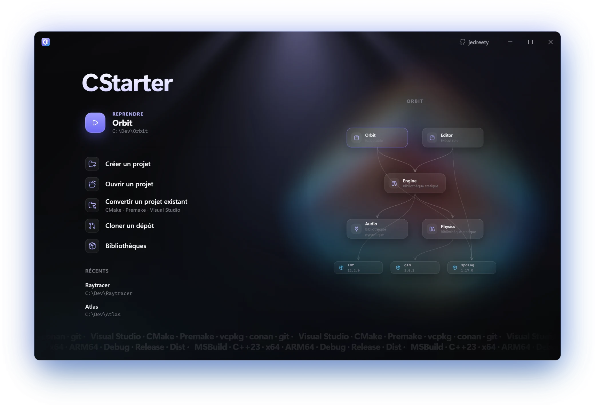
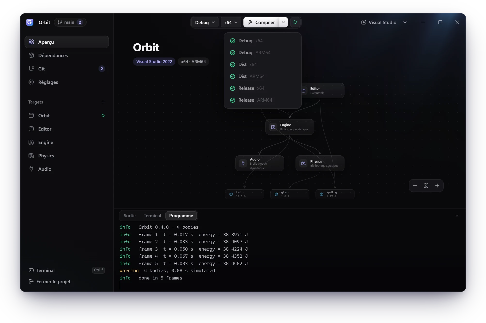
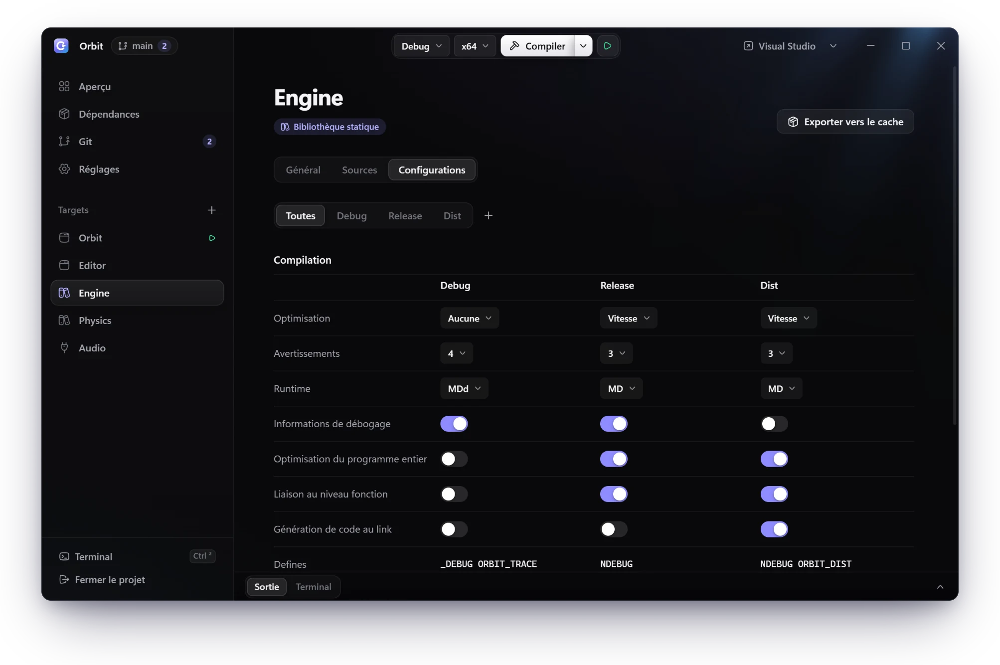
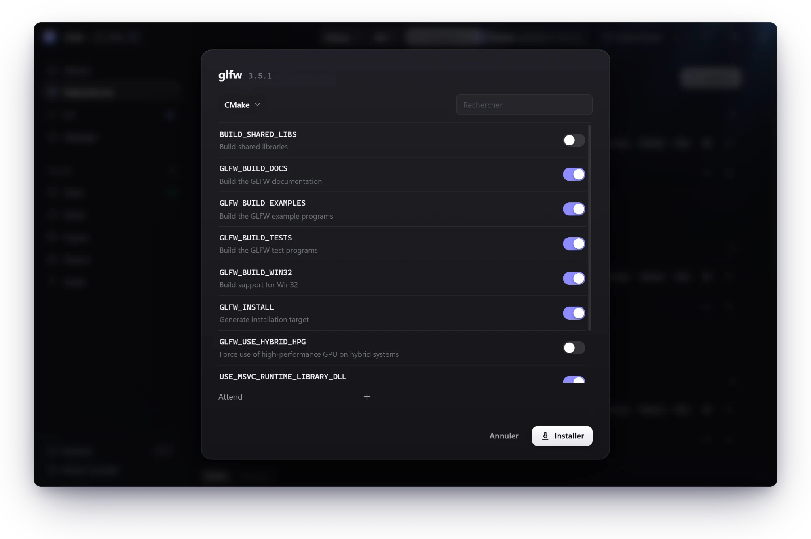
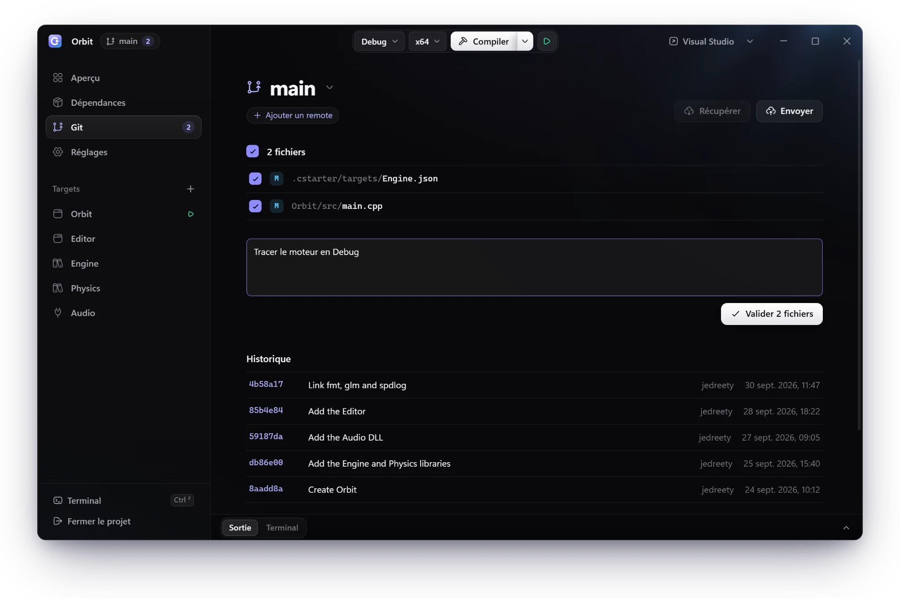

<div align="center">


# CStarter

### Le gestionnaire de projets C et C++ pour Windows

Décrivez votre projet une fois, en quelques petits fichiers JSON.<br>
CStarter écrit la solution Visual Studio, la compile et la lance.<br>
Vos bibliothèques suivent.

<br>

<a href="https://github.com/jedreety/CStarter/releases/latest"></a>

<br>

[](https://github.com/jedreety/CStarter/releases/latest)
[](#installation)
[](LICENSE)

[Fonctionnalités](#fonctionnalités) · [Installation](#installation) · [Premiers pas](#premiers-pas) · [Documentation](#documentation) · [English](README.md)

</div>

<br>

<p align="center">
  
</p>

## Fonctionnalités

### Un dossier, une vraie solution Visual Studio

Ni CMake, ni Premake, ni Lua à écrire.<br>
Votre projet vit dans `.cstarter/` : quelques fichiers JSON, versionnés avec votre code.<br>
CStarter en tire des `.sln` et des `.vcxproj` propres, identiques sur chaque machine.

```text
Orbit/
├── .cstarter/                  tout le projet
│   ├── project.json
│   ├── solution.json           plateformes, target de démarrage, liens entre targets
│   ├── targets/
│   │   ├── Engine.json         type, sources, configurations, bibliothèques
│   │   └── Orbit.json
│   └── dependencies.lock.json  la version exacte de chaque bibliothèque
├── Engine/
└── Orbit/
```

### Voir, compiler, lancer

Vos targets et les bibliothèques qu'ils lient, en un seul graphe.<br>
**Ctrl+Maj+B** compile chaque configuration pour chaque plateforme.<br>
**Ctrl+F5** lance votre programme, dans l'application même.

<p align="center">
  
</p>

### Chaque réglage, côte à côte

Debug, Release, Dist, ou le nom qui vous plaît.<br>
Comparez vos configurations d'un seul regard, et modifiez-les sur place.

<p align="center">
  
</p>

### Des bibliothèques en deux clics

Collez un lien, choisissez une version.<br>
CStarter montre les options de CMake, puis construit la bibliothèque pour votre projet.<br>
Une seule fois, dans un cache que partagent tous vos projets.

**GitHub · GitLab · vcpkg · conan · archives · dossiers locaux**

<p align="center">
  
</p>

### Git, intégré

Validez, envoyez, récupérez et changez de branche sans quitter l'application.<br>
`.cstarter/` fusionne selon sa structure : deux targets ajoutés sur deux branches se cumulent.<br>
Un projet cloné restaure ses bibliothèques et génère sa solution.

<p align="center">
  
</p>

### Et aussi

- **Convertir** un projet CMake, Premake ou Visual Studio, ou un simple dossier de sources.
- **Verrouiller** chaque bibliothèque sur sa source exacte, et la restaurer sur n'importe quelle machine.
- **Vendorer** une bibliothèque dans le projet, binaires compris.
- **Exporter** l'une de vos bibliothèques vers le cache, pour vos autres projets.
- **Visual Studio 2022 et 2026**, pour x64, x86 et ARM64.
- **Un terminal intégré**, et un clic pour ouvrir le projet dans Visual Studio ou VS Code.
- **Français et anglais**, dans l'application comme en ligne de commande.

## Installation

1. Téléchargez `CStarter-<version>-setup.exe` depuis la [dernière version](https://github.com/jedreety/CStarter/releases/latest).
2. Lancez-le. Il s'installe pour vous seul, sans droits d'administrateur.
3. Ouvrez CStarter. Il liste les outils qui vous manquent et installe ceux que vous choisissez.

CStarter fonctionne sous Windows 10 et 11, en 64 bits.<br>
Compiler demande Visual Studio 2022, ou ses Build Tools, avec le C++.

> [!NOTE]
> Les versions ne sont pas encore signées.<br>
> SmartScreen avertit au premier lancement de l'installeur.<br>
> Avec Smart App Control actif, Windows peut refuser une nouvelle version pendant un temps.

## Premiers pas

**Dans l'application**, choisissez **Créer un projet**, puis **Compiler** (Ctrl+B) et **Exécuter** (Ctrl+F5).<br>
Vous avez déjà un projet ? **Convertir un projet existant** le lit.

**Dans un terminal**, depuis un dossier qui contient les sources d'un programme :

```powershell
cstarter create   # propose des targets d'après vos sources, puis écrit .cstarter/
cstarter build    # génère la solution, puis la compile avec MSBuild
cstarter run      # compile, puis lance le target de démarrage
```

## Documentation

<details>
<summary><b>Mises à jour et désinstallation</b></summary>
<br>

- CStarter s'installe dans `%LOCALAPPDATA%\Programs\CStarter`.
- L'installeur peut ajouter `cstarter` au PATH, CStarter au menu Démarrer et à la recherche Windows, et un raccourci sur le bureau.
- L'application cherche une nouvelle version à son lancement. Elle la télécharge en arrière-plan et vérifie son empreinte SHA-256.
- Dès que Windows accepte le nouvel installeur, **Mettre à jour** apparaît dans la barre de titre. L'installeur remplace CStarter sans fenêtre et rouvre votre projet.
- `cstarter update` fait de même dans un terminal.
- Pour désinstaller, passez par *Applications installées* dans les Paramètres de Windows. Une case retire aussi les bibliothèques et les réglages (`%USERPROFILE%\.cstarter` et `%LOCALAPPDATA%\CStarter`). Les projets restent intacts.

</details>

<details>
<summary><b>Les outils que pilote CStarter</b></summary>
<br>

| Outil | Sert à |
|---|---|
| Visual Studio 2022 ou ses Build Tools, avec *Développement Desktop en C++* | compiler, toujours |
| CMake | les bibliothèques et les projets qui s'en servent |
| Premake 5 | les projets et les bibliothèques Premake |
| vcpkg, conan 2 | les ports vcpkg, les packages conan |
| git | git |

CStarter trouve le CMake et le vcpkg de Visual Studio quand ils ne sont pas dans le PATH.<br>
Les outils qui manquent sont listés au premier lancement, puis sous **Outils** dans le menu du logo. Ils s'installent par winget.

Dans un terminal, en acceptant les fenêtres UAC, Visual Studio 2022 avec la charge C++, les outils ARM64, CMake et vcpkg :

```powershell
winget install --id Microsoft.VisualStudio.2022.Community --exact --source winget --accept-package-agreements --accept-source-agreements --override "--passive --wait --norestart --add Microsoft.VisualStudio.Workload.NativeDesktop --includeRecommended --add Microsoft.VisualStudio.Component.VC.Tools.x86.x64 --add Microsoft.VisualStudio.Component.VC.Tools.ARM64 --add Microsoft.VisualStudio.Component.VC.CMake.Project --add Microsoft.VisualStudio.Component.Vcpkg"
```

Puis, selon les usages, CMake, Premake 5 et conan 2 :

```powershell
winget install --id Kitware.CMake --exact --source winget
winget install --id Premake.Premake.5.Beta --exact --source winget
winget install --id JFrog.Conan --exact --source winget
```

</details>

<details>
<summary><b>L'application</b></summary>
<br>

- L'accueil reprend le dernier projet, en crée, en ouvre ou en convertit un, clone un dépôt, et gère les **Bibliothèques** du cache.
- Dans un projet, la barre latérale réunit l'aperçu, les dépendances de chaque target, git, les réglages, puis chaque target.
- Les chemins se choisissent par l'icône de dossier de chaque champ. Le **+** d'une liste ouvre ce qu'on peut y ajouter.
- Lier une bibliothèque à un target la lie à toutes ses configurations.
- **Toutes**, parmi les configurations d'un target, les compare côte à côte.
- Les modifications restent en mémoire jusqu'à l'enregistrement.
- **Ouvrir dans**, dans la barre de titre, ouvre le projet dans Visual Studio ou VS Code.
- Le menu du logo réunit la langue, les outils et **Rechercher une mise à jour**.
- `cstarterw.exe DOSSIER` ouvre directement le projet de DOSSIER.

| Raccourci | Action |
|---|---|
| Ctrl+S | enregistrer |
| Ctrl+B | compiler la configuration et la plateforme choisies en haut |
| Ctrl+Maj+B | compiler chaque configuration pour chaque plateforme |
| Ctrl+F5 | compiler, puis lancer le target de démarrage dans l'onglet **Programme** |
| Ctrl+² (Ctrl+`` ` `` en QWERTY) | le terminal intégré : PowerShell dans le dossier du projet, où `cstarter` lance ce CStarter |

</details>

<details>
<summary><b>Ligne de commande</b></summary>
<br>

- Une commande travaille sur le projet que désigne `-p DOSSIER`, placé avant la commande.
- Sans `-p`, CStarter remonte depuis le dossier courant jusqu'à `.cstarter/`.
- `create` et `detect` prennent `--location` à la place, le dossier courant par défaut.
- `cstarter COMMANDE --help` décrit chaque commande.
- `build` et `run` prennent la première configuration et la première plateforme, sauf si `--config` et `--platform` en désignent d'autres.

| Commandes | Rôle |
|---|---|
| `create`, `detect` | créer un projet, depuis les sources du dossier s'il y en a ; importer un dossier qui a déjà une configuration de build |
| `generate`, `build`, `clean` | générer la solution ; générer puis compiler, `--all` pour toute la matrice ; supprimer fichiers générés et sorties |
| `run`, `get-program` | compiler puis lancer le target de démarrage, avec ses réglages de débogage ; afficher ce que `run` lance |
| `get-project`, `get-vcxprojs`, `get-vcxproj` | afficher le projet, la liste des targets, un target |
| `add-platform`, `remove-platform`, `set-startup`, `set-sln-output` | la solution : ses plateformes (x64, x86, ARM64), son target de démarrage, le dossier du `.sln` |
| `add-define`, `remove-define` | les defines globaux ; `--string` pour une chaîne C |
| `add-target`, `remove-target`, `rename-target` | les targets ; renommer suit les liens, le démarrage et les sorties par défaut |
| `add-config`, `remove-config`, `rename-config`, `add-config-define`, `remove-config-define` | les configurations d'un target ; `add-config --copy-of` copie aussi les bibliothèques liées |
| `add-project-ref`, `remove-project-ref`, `set-project-ref` | les liens entre targets ; `--map Dist=Release` |
| `set-source-dirs`, `add-include-dir`, `set-public-headers`, `set-vcxproj-dir`, `set-pch` | les sources et les sorties d'un target, son en-tête précompilé |
| `analyze-dep`, `install-dep` | examiner une source sans la compiler ; l'installer dans le cache, ou ajouter des plateformes à une entrée |
| `link-dep`, `unlink-dep` | lier une entrée du cache à une configuration d'un target ; la délier |
| `list-deps`, `get-dependency`, `get-dependencies`, `remove-dep` | lister le cache, afficher une entrée, lister celles du projet ; supprimer une entrée |
| `restore`, `vendor-dep`, `unvendor-dep`, `export-dep` | reconstruire ce qui manque au cache ; copier une entrée dans le projet, ou l'en retirer ; faire d'un target une entrée |
| `init`, `clone`, `status`, `add`, `commit`, `push`, `pull`, `branch`, `switch`, `merge`, `remote`, `log`, `diff`, `discard` | git |
| `language` | afficher ou choisir la langue : `fr` ou `en` |
| `update` | installer la dernière version publiée de CStarter |

Les autres réglages (runtime, optimisation, options libres du compilateur) vivent dans les JSON de `.cstarter/`, ou dans l'application.<br>
Les fichiers générés ne se modifient pas : la génération suivante les écrase, et supprime ceux que plus rien ne produit.

</details>

<details>
<summary><b>Bibliothèques</b></summary>
<br>

- Le cache est dans `%USERPROFILE%\.cstarter\`, partagé par tous les projets.
- Une entrée est une seule configuration de build, pour une ou plusieurs plateformes : `fmt` en header-only, `spdlog_mdd` en `MDd`, `spdlog_md` en `MD`.
- Dans l'application, **Installer** ne demande qu'un lien. Un dépôt GitHub ou GitLab propose ensuite ses versions, la dernière d'abord, et ses branches.
- CMake configure la source et montre ses options, avec leur aide. Seules celles que vous changez deviennent des options du build.
- L'application construit une entrée par runtime des configurations de votre projet, pour les plateformes de sa solution. Un header-only n'en fait qu'une.

| Source | Forme |
|---|---|
| GitHub, GitLab | `https://github.com/…` ou `https://gitlab.com/…`, avec `--tag` résolu en commit |
| Archive | `https://…` |
| Dossier local | un chemin |
| vcpkg | `vcpkg:PORT`, avec `--tag` pour sa version exacte |
| conan | `conan:NOM/VERSION` |

| Builder | Options |
|---|---|
| `none` (header-only) | `--flag include=DOSSIER` |
| `cmake` | `--flag=-DOPTION=VALEUR` |
| `manual` | `--flag include=DOSSIER`, `--flag lib/x64=DOSSIER`, `--flag bin/x64=DOSSIER` |
| `msbuild`, `premake` | `--flag sln=FICHIER`, `--flag target=PROJET`, `--flag configuration=NOM`, `--flag include=DOSSIER` |
| `vcpkg` | `--flag linkage=static` ou `--flag linkage=dynamic` (défaut en `MD`) |
| `conan` | `--flag=-o=fmt/*:shared=True` |

```powershell
cstarter install-dep fmt 12.2.0 https://github.com/fmtlib/fmt --tag 12.2.0 --build none
cstarter install-dep lz4_md 1.10.0 vcpkg:lz4 --tag 1.10.0 --runtime MD
cstarter install-dep zlib_md 1.3.1 conan:zlib/1.3.1 --runtime MD
cstarter link-dep App Debug fmt 12.2.0
```

- `install-dep` montre d'abord l'analyse, puis demande le système de build, sauf si `--build` le donne.
- `--require NOM` nomme une entrée que celle-ci attend : `link-dep` et `generate` avertissent quand la configuration ne la lie pas.
- La liaison refuse une entrée dont le runtime diffère de celui de la configuration, une entrée à qui manque une plateforme de la solution, et deux entrées issues de la même source.
- `msbuild` et `premake` imposent le runtime de l'entrée et le toolset v143 à tous les projets de leur solution.
- Un package conan sans binaire pour vos réglages se construit depuis ses sources.
- Une entrée ne déclare pas les defines et les options qu'elle attend : le projet les écrit lui-même (fmt 11, par exemple, exige `/utf-8`).
- `GITHUB_TOKEN` et `GITLAB_TOKEN`, s'ils existent, servent aux dépôts privés et à la limite de débit des API.

</details>

<details>
<summary><b>Portabilité</b></summary>
<br>

- `dependencies.lock.json`, versionné avec le projet, décrit chaque entrée liée : sa source exacte (commit, empreintes, baseline de vcpkg, révision de conan) et sa recette.
- Sur une autre machine, `restore` reconstruit ce qui manque au cache, empreintes vérifiées. Ensuite, `generate` et `build` suffisent.
- Une entrée locale (un dossier, un target exporté) ne se reconstruit pas ailleurs : `restore` la signale.
- `vendor-dep NOM VERSION` copie une entrée dans `.cstarter/vendor/`, binaires compris. Le projet fonctionne alors sans le cache, sur toutes les machines.
- `export-dep TARGET CONFIG NOM VERSION` compile un target de type bibliothèque et en fait une entrée du cache : ses headers publics, ses `.lib`, `.dll` et `.pdb`.

</details>

<details>
<summary><b>Convertir un projet</b></summary>
<br>

- `cstarter detect [NOM] [--location DOSSIER]`, ou **Convertir un projet existant** dans l'application.
- Il lit les solutions Visual Studio, CMake, Premake, `vcpkg.json`, `conanfile.txt`, git et, à défaut, les sources seules.
- Il montre ce qu'il a reconnu et ce qu'il n'a pas su traduire, puis écrit `.cstarter/` après confirmation.
- Lire un `CMakeLists.txt` ou un `premake5.lua` exécute le code du projet : CStarter demande d'abord.
- Les bibliothèques de `vcpkg.json` et de `conanfile.txt` s'installent dans le cache, une entrée par runtime, liée à chaque target.
- Avec les seules sources, il demande le type de chaque target, comme `create`.
- Il propose ensuite de supprimer les anciens fichiers de configuration qu'il a traduits. Jamais d'office.

</details>

<details>
<summary><b>git</b></summary>
<br>

```powershell
cstarter -p DOSSIER init
cstarter -p DOSSIER add DOSSIER
cstarter -p DOSSIER commit -m "Projet initial"
cstarter clone URL DOSSIER
```

- `init` crée le dépôt, écrit `.gitignore` et `.gitattributes`, et déclare le pilote de fusion. Il propose Git LFS pour les binaires vendorés.
- Un `.gitignore` existant n'est complété qu'après confirmation. Dans un dépôt cloné sans CStarter, `init` déclare le pilote.
- `clone` restaure les bibliothèques, puis génère la solution.
- `pull`, `merge` et `switch` régénèrent la solution quand `.cstarter/` a changé.
- Le pilote fusionne `.cstarter/` selon sa structure : targets, defines ou plateformes ajoutés de chaque côté se cumulent.
- Un vrai désaccord reste entre les marqueurs de git, autour du seul réglage en cause. Dans l'application, **Marquer résolu** prépare le fichier réparé.
- `remote`, `log`, `diff` et `discard` font le reste. `discard` demande d'abord.

</details>

<details>
<summary><b>Visual Studio 2026</b></summary>
<br>

- `"generator": "vs2026"` dans `.cstarter/project.json`, ou le générateur dans les réglages de l'application, vise Visual Studio 2026 (toolset `v145`).
- `generate` prévient quand aucune installation de Visual Studio n'a le toolset du générateur.
- `build` prend le MSBuild de la plus récente installation qui l'a.

</details>

<details>
<summary><b>Langue</b></summary>
<br>

- CStarter parle français ou anglais : l'application, ses messages et la ligne de commande.
- Choisissez-la par le menu du logo, ou par `cstarter language fr`. Le choix vaut pour les deux.
- Sans choix, CStarter suit Windows. MSBuild la suit par `VSLANG`.
- Ce que CStarter écrit dans un projet ne dépend jamais de la langue.

</details>

<details>
<summary><b>Construire depuis les sources</b></summary>
<br>

CStarter n'utilise que Python 3.13 et sa bibliothèque standard.<br>
L'application demande aussi pywebview, et Node.js pour construire sa page une fois.

```powershell
py -3.13 -m venv .venv
.venv\Scripts\activate
python -m pip install pywebview==6.2.1
cd cstarter\gui\web
npm ci
npm run build
```

Ensuite, depuis la racine du dépôt, `python -m cstarter` est la ligne de commande, et `python -m cstarter.gui [DOSSIER]` l'application.

**L'installeur.** PyInstaller s'installe dans le venv, figé par empreintes. Inno Setup vient de winget :

```powershell
python -m pip install -r scripts/distribution/requirements.txt
winget install --id JRSoftware.InnoSetup --exact --source winget --scope user
python scripts/distribution.py C:\cstarter-dist
```

La dernière commande construit la page, l'application avec `THIRD-PARTY-NOTICES.txt`, `CStarter-<version>-setup.exe` et `latest.json`, dans un dossier hors du dépôt.<br>
Un tel installeur ne sert qu'aux essais. Les versions publiées sont construites par GitHub Actions à partir d'un tag `v<version>` ([`publication.yml`](.github/workflows/publication.yml)), puis vérifiées et publiées par `scripts/publication.py`.

**Vérifier une modification.** Pas de suite de tests : une modification se vérifie en comparant des générations, chaque fois dans un dossier neuf hors du dépôt.

```powershell
python scripts/generations.py C:\cstarter-gen\avant
python scripts/generations.py C:\cstarter-gen\apres
git -c core.autocrlf=false diff --no-index C:\cstarter-gen\avant C:\cstarter-gen\apres
```

Un refactoring laisse les fichiers générés identiques à l'octet près.<br>
Un changement de comportement ne modifie que les lignes qu'il annonce.

Les exemples `import-*` passent par `detect` en répondant oui à tout, sur leur copie : ils exigent CMake, premake5, vcpkg ou conan, et le réseau pour vcpkg et conan.<br>
`exemples/dependances/` ne se génère que si ses entrées sont dans le cache :

```powershell
cstarter install-dep fmt 12.2.0 https://github.com/fmtlib/fmt --tag 12.2.0 --build none
cstarter install-dep spdlog_debug 1.17.0 https://github.com/gabime/spdlog --tag v1.17.0 --build cmake --runtime MDd --platform x64 --platform ARM64 --flag=-DSPDLOG_BUILD_SHARED=ON --flag=-DSPDLOG_USE_STD_FORMAT=ON --flag=-DSPDLOG_BUILD_EXAMPLE=OFF
cstarter install-dep spdlog_release 1.17.0 https://github.com/gabime/spdlog --tag v1.17.0 --build cmake --runtime MD --platform x64 --platform ARM64 --flag=-DSPDLOG_BUILD_SHARED=ON --flag=-DSPDLOG_USE_STD_FORMAT=ON --flag=-DSPDLOG_BUILD_EXAMPLE=OFF
```

</details>

## Signature

Free code signing provided by [SignPath.io](https://about.signpath.io/), certificate by [SignPath Foundation](https://signpath.org/).<br>
La signature est offerte par SignPath.io, le certificat par SignPath Foundation.

La [politique de signature](CODE_SIGNING.md) dit ce qui est signé, comment les versions sont construites et qui les approuve.<br>
La signature commence quand SignPath Foundation accepte le projet. Les versions jusqu'à la 0.1.4 ne sont pas signées.

## Confidentialité

CStarter ne collecte aucune donnée et n'envoie aucune télémétrie.

Au lancement de l'application, il demande à github.com si une version plus récente existe.<br>
S'il y en a une, il télécharge son installeur depuis GitHub.

Tout le reste n'a lieu qu'à votre demande :

- les bibliothèques que vous installez, depuis GitHub, GitLab, vcpkg, conan ou une adresse que vous donnez
- les opérations git sur les dépôts que vous choisissez
- les outils que vous retenez, installés par winget

## Licence

CStarter est publié sous [licence MIT](LICENSE).<br>
L'installeur livre aussi des composants d'autrui, sous leur propre licence.<br>
`THIRD-PARTY-NOTICES.txt`, dans le dossier d'installation, les liste.

<br>

<p align="center">
  <br>
  <sub>Fait pour le C et le C++ sous Windows</sub>
</p>
