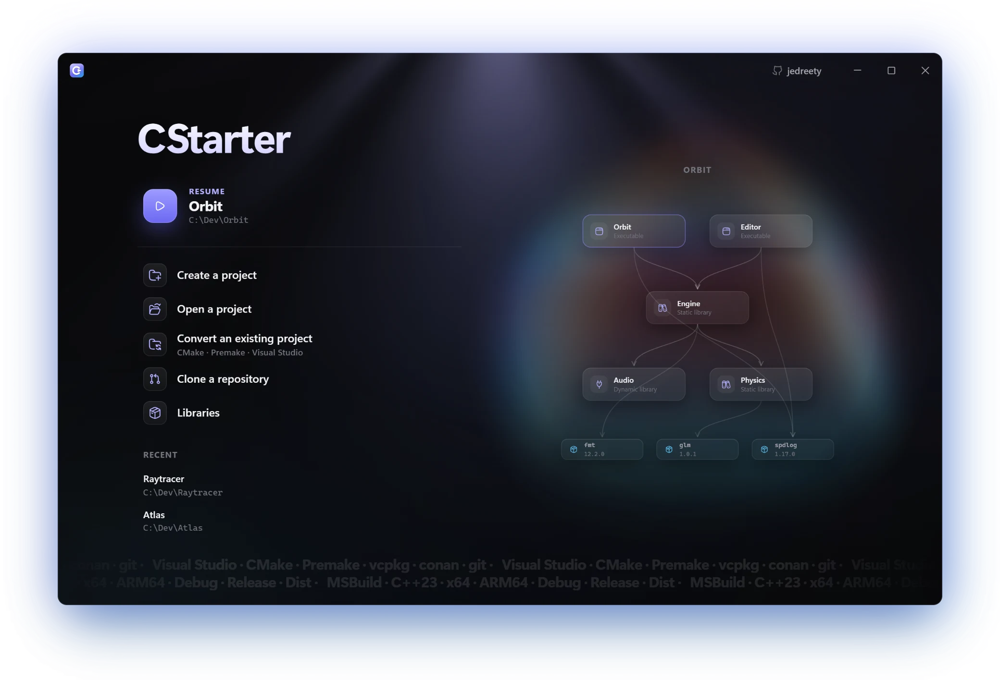
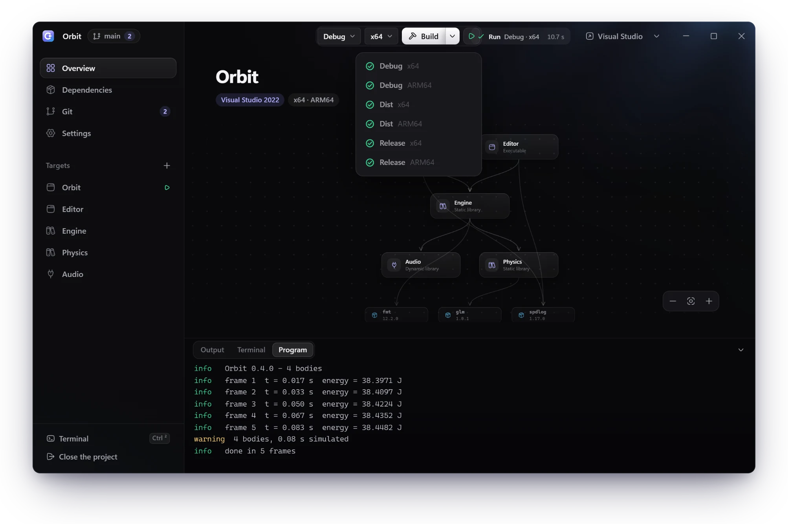
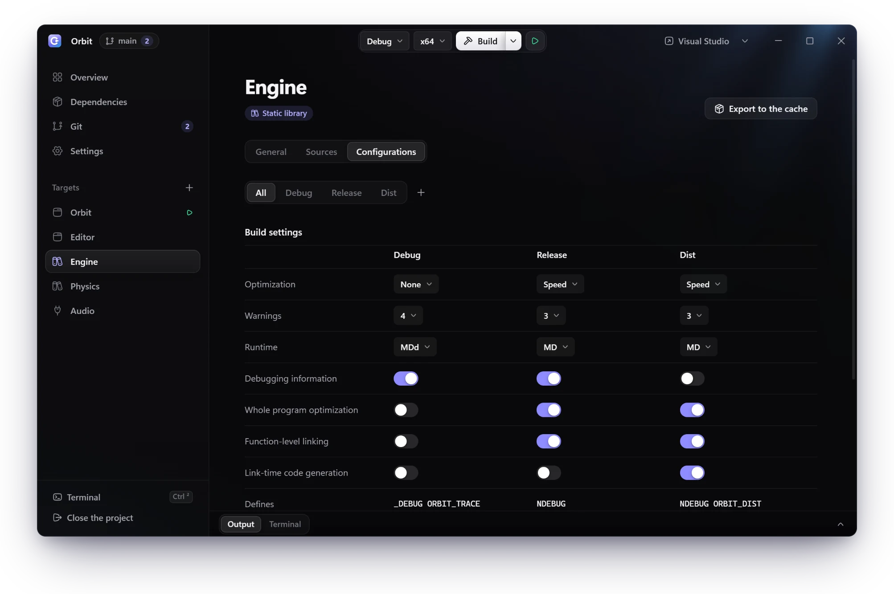
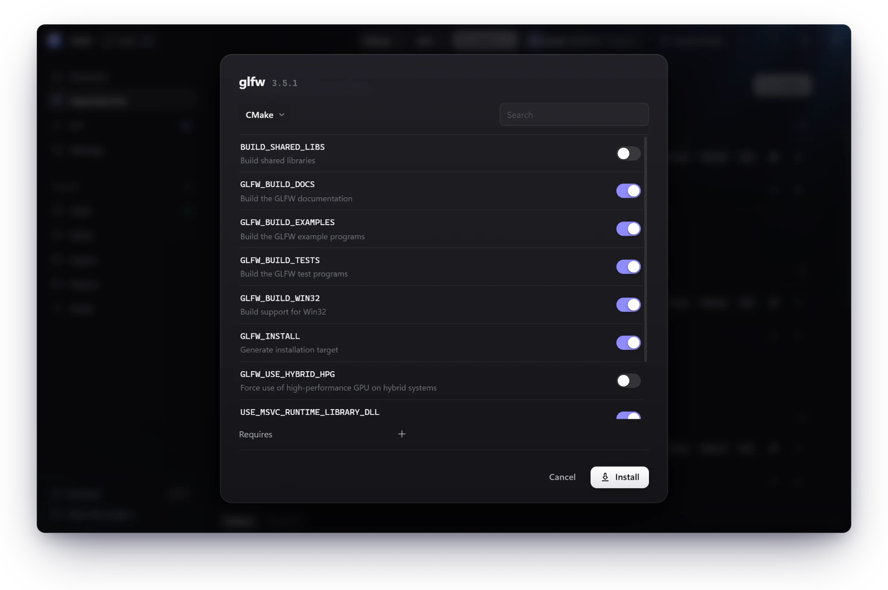
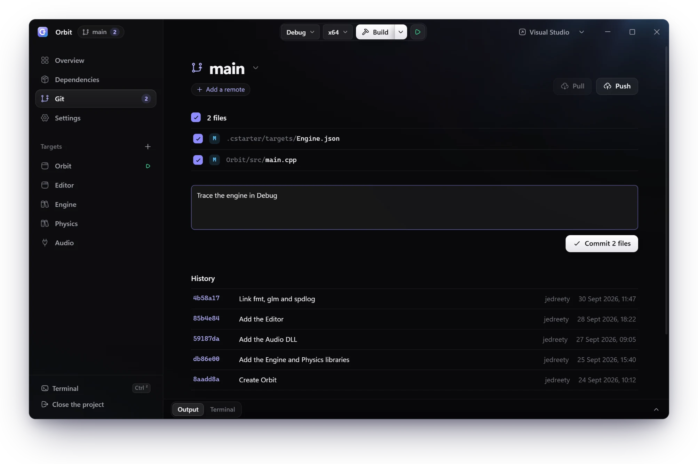

<div align="center">


# CStarter

### The C and C++ project manager for Windows

Describe your project once, in a few small JSON files.<br>
CStarter writes the Visual Studio solution, builds it and runs it.<br>
Your libraries come along.

[](https://github.com/jedreety/CStarter/releases/latest)
[](#install)
[](LICENSE)

[Features](#features) · [Install](#install) · [Quick start](#quick-start) · [Documentation](#documentation) · [Français](README.fr.md)

</div>

<br>

<p align="center">
  
</p>

## Features

### One folder, a real Visual Studio solution

No CMake, no Premake, no Lua to write.<br>
Your project lives in `.cstarter/`, a few JSON files versioned with your code.<br>
CStarter turns them into clean `.sln` and `.vcxproj` files, identical on every machine.

```text
Orbit/
├── .cstarter/                  the whole project
│   ├── project.json
│   ├── solution.json           platforms, startup target, links between targets
│   ├── targets/
│   │   ├── Engine.json         type, sources, configurations, libraries
│   │   └── Orbit.json
│   └── dependencies.lock.json  the exact version of every library
├── Engine/
└── Orbit/
```

### See it, build it, run it

Your targets and the libraries they link, in one graph.<br>
**Ctrl+Shift+B** builds every configuration for every platform.<br>
**Ctrl+F5** runs your program right inside the app.

<p align="center">
  
</p>

### Every setting, side by side

Debug, Release, Dist, or any name you like.<br>
Compare your configurations in one view, and change them in place.

<p align="center">
  
</p>

### Libraries in two clicks

Paste a link, pick a version.<br>
CStarter shows the CMake options, then builds the library for your project.<br>
Once, in a cache that all your projects share.

**GitHub · GitLab · vcpkg · conan · archives · local folders**

<p align="center">
  
</p>

### Git, built in

Commit, push, pull and switch branches without leaving the app.<br>
`.cstarter/` merges by its structure: two targets added on two branches simply add up.<br>
A cloned project restores its libraries and generates its solution.

<p align="center">
  
</p>

### And also

- **Convert** a CMake, Premake or Visual Studio project, or a plain folder of sources.
- **Lock** every library to its exact source, and restore it on any machine.
- **Vendor** a library into the project, binaries included.
- **Export** one of your libraries to the cache, for your other projects.
- **Visual Studio 2022 and 2026**, for x64, x86 and ARM64.
- **A built-in terminal**, and one click to open the project in Visual Studio or VS Code.
- **English and French**, in the app and on the command line.

## Install

1. Download `CStarter-<version>-setup.exe` from the [latest release](https://github.com/jedreety/CStarter/releases/latest).
2. Run it. It installs for you alone, without administrator rights.
3. Open CStarter. It lists the tools you lack and installs the ones you pick.

CStarter runs on 64-bit Windows 10 and 11.<br>
Building needs Visual Studio 2022, or its Build Tools, with C++.

> [!NOTE]
> Releases are not code-signed yet.<br>
> SmartScreen warns the first time you run the installer.<br>
> With Smart App Control on, Windows may refuse a new release for a while.

## Quick start

**In the app**, choose **Create a project**, then **Build** (Ctrl+B) and **Run** (Ctrl+F5).<br>
Already have a project? **Convert an existing project** reads it.

**In a terminal**, in a folder that holds the sources of a program:

```powershell
cstarter create   # proposes targets from your sources, then writes .cstarter/
cstarter build    # generates the solution, then builds it with MSBuild
cstarter run      # builds, then runs the startup target
```

## Documentation

<details>
<summary><b>Updates and uninstall</b></summary>
<br>

- CStarter installs in `%LOCALAPPDATA%\Programs\CStarter`.
- The installer can add `cstarter` to the PATH, CStarter to the Start menu and Windows search, and a desktop shortcut.
- The app looks for a new release when it starts. It downloads it in the background and checks its SHA-256 hash.
- Once Windows accepts the new installer, **Update** appears in the title bar. The installer replaces CStarter without a window and reopens your project.
- `cstarter update` does the same from a terminal.
- To uninstall, use *Installed apps* in Windows Settings. A checkbox also removes the libraries and the settings (`%USERPROFILE%\.cstarter` and `%LOCALAPPDATA%\CStarter`). Projects are never touched.

</details>

<details>
<summary><b>The tools CStarter drives</b></summary>
<br>

| Tool | Needed for |
|---|---|
| Visual Studio 2022 or its Build Tools, with *Desktop development with C++* | building, always |
| CMake | the libraries and projects that use it |
| Premake 5 | Premake projects and libraries |
| vcpkg, conan 2 | vcpkg ports, conan packages |
| git | git |

CStarter finds the CMake and vcpkg of Visual Studio when they are not in the PATH.<br>
Missing tools are listed at first launch, then under **Tools** in the logo menu. They install through winget.

From a terminal, accepting the UAC prompts, Visual Studio 2022 with the C++ workload, the ARM64 tools, CMake and vcpkg:

```powershell
winget install --id Microsoft.VisualStudio.2022.Community --exact --source winget --accept-package-agreements --accept-source-agreements --override "--passive --wait --norestart --add Microsoft.VisualStudio.Workload.NativeDesktop --includeRecommended --add Microsoft.VisualStudio.Component.VC.Tools.x86.x64 --add Microsoft.VisualStudio.Component.VC.Tools.ARM64 --add Microsoft.VisualStudio.Component.VC.CMake.Project --add Microsoft.VisualStudio.Component.Vcpkg"
```

Then, as needed, CMake, Premake 5 and conan 2:

```powershell
winget install --id Kitware.CMake --exact --source winget
winget install --id Premake.Premake.5.Beta --exact --source winget
winget install --id JFrog.Conan --exact --source winget
```

</details>

<details>
<summary><b>The app</b></summary>
<br>

- The home screen resumes the last project, creates, opens or converts one, clones a repository, and manages the **Libraries** of the cache.
- Inside a project, the sidebar holds the overview, the dependencies of each target, git, the settings, then each target.
- Paths come from the folder icon of each field. The **+** of a list opens what can be added to it.
- Linking a library to a target links it to all of its configurations.
- **All**, among the configurations of a target, compares them side by side.
- Changes stay in memory until you save.
- **Open in**, in the title bar, opens the project in Visual Studio or VS Code.
- The logo menu holds the language, the tools and **Check for updates**.
- `cstarterw.exe FOLDER` opens the project of FOLDER directly.

| Shortcut | Action |
|---|---|
| Ctrl+S | save |
| Ctrl+B | build the configuration and platform chosen at the top |
| Ctrl+Shift+B | build every configuration for every platform |
| Ctrl+F5 | build, then run the startup target in the **Program** tab |
| Ctrl+`` ` `` (Ctrl+² on AZERTY) | the built-in terminal: PowerShell in the project folder, where `cstarter` runs this CStarter |

</details>

<details>
<summary><b>Command line</b></summary>
<br>

- A command works on the project given by `-p FOLDER`, placed before the command.
- Without `-p`, CStarter looks for `.cstarter/` from the current folder upward.
- `create` and `detect` take `--location` instead, the current folder by default.
- `cstarter COMMAND --help` describes each command.
- `build` and `run` use the first configuration and platform, unless `--config` and `--platform` say otherwise.

| Commands | Purpose |
|---|---|
| `create`, `detect` | create a project, from the sources of the folder if any; import a folder that already has a build setup |
| `generate`, `build`, `clean` | generate the solution; generate then build, `--all` for every configuration and platform; remove generated files and outputs |
| `run`, `get-program` | build, then run the startup target with its debugging settings; show what `run` launches |
| `get-project`, `get-vcxprojs`, `get-vcxproj` | show the project, the list of targets, a target |
| `add-platform`, `remove-platform`, `set-startup`, `set-sln-output` | the solution: its platforms (x64, x86, ARM64), its startup target, the folder of the `.sln` |
| `add-define`, `remove-define` | global defines; `--string` for a C string |
| `add-target`, `remove-target`, `rename-target` | targets; renaming follows links, the startup target and default outputs |
| `add-config`, `remove-config`, `rename-config`, `add-config-define`, `remove-config-define` | the configurations of a target; `add-config --copy-of` also copies the linked libraries |
| `add-project-ref`, `remove-project-ref`, `set-project-ref` | links between targets; `--map Dist=Release` |
| `set-source-dirs`, `add-include-dir`, `set-public-headers`, `set-vcxproj-dir`, `set-pch` | the sources and outputs of a target, its precompiled header |
| `analyze-dep`, `install-dep` | examine a source without building it; install it in the cache, or add platforms to an entry |
| `link-dep`, `unlink-dep` | link a cache entry to a configuration of a target; unlink it |
| `list-deps`, `get-dependency`, `get-dependencies`, `remove-dep` | list the cache, show an entry, list the entries of the project; remove an entry |
| `restore`, `vendor-dep`, `unvendor-dep`, `export-dep` | rebuild what the cache lacks; copy an entry into the project, or take it out; make a target an entry |
| `init`, `clone`, `status`, `add`, `commit`, `push`, `pull`, `branch`, `switch`, `merge`, `remote`, `log`, `diff`, `discard` | git |
| `language` | show or choose the language: `en` or `fr` |
| `update` | install the latest release of CStarter |

Other settings (runtime, optimization, free compiler options) live in the JSON files of `.cstarter/`, or in the app.<br>
Generated files are not meant to be edited: the next generation overwrites them, and deletes those nothing produces any more.

</details>

<details>
<summary><b>Libraries</b></summary>
<br>

- The cache lives in `%USERPROFILE%\.cstarter\`, shared by all projects.
- An entry is one build configuration, for one or more platforms: `fmt` header-only, `spdlog_mdd` built with `MDd`, `spdlog_md` with `MD`.
- In the app, **Install** asks only for a link. A GitHub or GitLab repository then offers its versions, the latest first, and its branches.
- CMake configures the source and shows its options, with their help. Only the ones you change become build options.
- The app builds one entry per runtime of your project's configurations, for the platforms of its solution. A header-only library makes only one.

| Source | Form |
|---|---|
| GitHub, GitLab | `https://github.com/…` or `https://gitlab.com/…`, with `--tag` resolved to a commit |
| Archive | `https://…` |
| Local folder | a path |
| vcpkg | `vcpkg:PORT`, with `--tag` for its exact version |
| conan | `conan:NAME/VERSION` |

| Builder | Options |
|---|---|
| `none` (header-only) | `--flag include=FOLDER` |
| `cmake` | `--flag=-DOPTION=VALUE` |
| `manual` | `--flag include=FOLDER`, `--flag lib/x64=FOLDER`, `--flag bin/x64=FOLDER` |
| `msbuild`, `premake` | `--flag sln=FILE`, `--flag target=PROJECT`, `--flag configuration=NAME`, `--flag include=FOLDER` |
| `vcpkg` | `--flag linkage=static` or `--flag linkage=dynamic` (the default with `MD`) |
| `conan` | `--flag=-o=fmt/*:shared=True` |

```powershell
cstarter install-dep fmt 12.2.0 https://github.com/fmtlib/fmt --tag 12.2.0 --build none
cstarter install-dep lz4_md 1.10.0 vcpkg:lz4 --tag 1.10.0 --runtime MD
cstarter install-dep zlib_md 1.3.1 conan:zlib/1.3.1 --runtime MD
cstarter link-dep App Debug fmt 12.2.0
```

- `install-dep` shows the analysis first, then asks for the build system, unless `--build` gives it.
- `--require NAME` names an entry this one expects: `link-dep` and `generate` warn when the configuration does not link it.
- Linking refuses an entry whose runtime differs from the configuration's, an entry that lacks a platform of the solution, and two entries from the same source.
- `msbuild` and `premake` impose the runtime of the entry and the v143 toolset on every project of their solution.
- A conan package without binaries for your settings is built from its sources.
- An entry does not declare the defines and options it expects: the project writes them itself (fmt 11, for instance, needs `/utf-8`).
- `GITHUB_TOKEN` and `GITLAB_TOKEN`, when set, are used for private repositories and API rate limits.

</details>

<details>
<summary><b>Portability</b></summary>
<br>

- `dependencies.lock.json`, committed with the project, describes each linked entry: its exact source (commit, hashes, vcpkg baseline, conan revision) and its recipe.
- On another machine, `restore` rebuilds what the cache lacks, hashes checked. Then `generate` and `build` are enough.
- A local entry (a folder, an exported target) cannot be rebuilt elsewhere: `restore` reports it.
- `vendor-dep NAME VERSION` copies an entry into `.cstarter/vendor/`, binaries included. The project then works without the cache, on every machine.
- `export-dep TARGET CONFIG NAME VERSION` builds a library target and makes it a cache entry: its public headers, `.lib`, `.dll` and `.pdb` files.

</details>

<details>
<summary><b>Converting a project</b></summary>
<br>

- `cstarter detect [NAME] [--location FOLDER]`, or **Convert an existing project** in the app.
- It reads Visual Studio solutions, CMake, Premake, `vcpkg.json`, `conanfile.txt`, git and, failing those, plain sources.
- It shows what it recognized and what it could not translate, then writes `.cstarter/` after confirmation.
- Reading a `CMakeLists.txt` or a `premake5.lua` runs the project's code: CStarter asks first.
- The libraries of `vcpkg.json` and `conanfile.txt` are installed in the cache, one entry per runtime, and linked to each target.
- With only sources, it asks for the type of each target, as `create` does.
- It then offers to delete the old configuration files it translated. It never does so on its own.

</details>

<details>
<summary><b>git</b></summary>
<br>

```powershell
cstarter -p FOLDER init
cstarter -p FOLDER add FOLDER
cstarter -p FOLDER commit -m "Initial project"
cstarter clone URL FOLDER
```

- `init` creates the repository, writes `.gitignore` and `.gitattributes`, and declares the merge driver. It offers Git LFS for vendored binaries.
- An existing `.gitignore` is completed only after confirmation. In a repository cloned without CStarter, `init` declares the driver.
- `clone` restores the libraries, then generates the solution.
- `pull`, `merge` and `switch` regenerate the solution when `.cstarter/` changed.
- The driver merges `.cstarter/` by its structure: targets, defines or platforms added on each side add up.
- A real disagreement stays between git's markers, around the one setting at stake. In the app, **Mark resolved** stages the repaired file.
- `remote`, `log`, `diff` and `discard` cover the rest. `discard` asks first.

</details>

<details>
<summary><b>Visual Studio 2026</b></summary>
<br>

- `"generator": "vs2026"` in `.cstarter/project.json`, or the generator in the app's settings, targets Visual Studio 2026 (toolset `v145`).
- `generate` warns when no Visual Studio installation has the toolset of the generator.
- `build` uses the MSBuild of the most recent installation that has it.

</details>

<details>
<summary><b>Language</b></summary>
<br>

- CStarter speaks English or French: the app, its messages and the command line.
- Choose it from the logo menu, or with `cstarter language en`. The choice holds for both.
- Without a choice, CStarter follows Windows. MSBuild follows it through `VSLANG`.
- What CStarter writes into a project never depends on the language.

</details>

<details>
<summary><b>Building from source</b></summary>
<br>

CStarter needs Python 3.13 and its standard library only.<br>
The app also needs pywebview, and Node.js to build its page once.

```powershell
py -3.13 -m venv .venv
.venv\Scripts\activate
python -m pip install pywebview==6.2.1
cd cstarter\gui\web
npm ci
npm run build
```

Then, from the root of the repository, `python -m cstarter` is the command line, and `python -m cstarter.gui [FOLDER]` the app.

**The installer.** PyInstaller goes in the venv, pinned with hashes. Inno Setup comes from winget:

```powershell
python -m pip install -r scripts/distribution/requirements.txt
winget install --id JRSoftware.InnoSetup --exact --source winget --scope user
python scripts/distribution.py C:\cstarter-dist
```

The last command builds the page, the app with `THIRD-PARTY-NOTICES.txt`, `CStarter-<version>-setup.exe` and `latest.json`, into a folder outside the repository.<br>
Such an installer is only for testing. Releases are built by GitHub Actions from a `v<version>` tag ([`publication.yml`](.github/workflows/publication.yml)), then checked and published by `scripts/publication.py`.

**Checking a change.** There is no test suite: a change is checked by comparing generations, each time into a new folder outside the repository.

```powershell
python scripts/generations.py C:\cstarter-gen\before
python scripts/generations.py C:\cstarter-gen\after
git -c core.autocrlf=false diff --no-index C:\cstarter-gen\before C:\cstarter-gen\after
```

A refactoring leaves the generated files identical to the byte.<br>
A change of behaviour changes only the lines it announces.

The `import-*` examples go through `detect`, answering yes to everything, on their copy: they need CMake, premake5, vcpkg or conan, and the network for vcpkg and conan.<br>
`exemples/dependances/` is generated only if its entries are in the cache:

```powershell
cstarter install-dep fmt 12.2.0 https://github.com/fmtlib/fmt --tag 12.2.0 --build none
cstarter install-dep spdlog_debug 1.17.0 https://github.com/gabime/spdlog --tag v1.17.0 --build cmake --runtime MDd --platform x64 --platform ARM64 --flag=-DSPDLOG_BUILD_SHARED=ON --flag=-DSPDLOG_USE_STD_FORMAT=ON --flag=-DSPDLOG_BUILD_EXAMPLE=OFF
cstarter install-dep spdlog_release 1.17.0 https://github.com/gabime/spdlog --tag v1.17.0 --build cmake --runtime MD --platform x64 --platform ARM64 --flag=-DSPDLOG_BUILD_SHARED=ON --flag=-DSPDLOG_USE_STD_FORMAT=ON --flag=-DSPDLOG_BUILD_EXAMPLE=OFF
```

</details>

## Code signing

Free code signing provided by [SignPath.io](https://about.signpath.io/), certificate by [SignPath Foundation](https://signpath.org/).

The [code signing policy](CODE_SIGNING.md) says what gets signed, how releases are built and who approves them.<br>
Signing starts once SignPath Foundation accepts the project. Releases up to 0.1.4 are not signed.

## Privacy

CStarter collects no data and sends no telemetry.

When the app starts, it asks github.com whether a newer release exists.<br>
If one does, it downloads its installer from GitHub.

Everything else happens only when you ask for it:

- the libraries you install, from GitHub, GitLab, vcpkg, conan or an address you give
- the git operations on the repositories you choose
- the tools you pick, through winget

## License

CStarter is released under the [MIT license](LICENSE).<br>
The installer also ships third-party components, under their own licenses.<br>
`THIRD-PARTY-NOTICES.txt`, in the installation folder, lists them.

<br>

<p align="center">
  <br>
  <sub>Made for C and C++ on Windows</sub>
</p>
